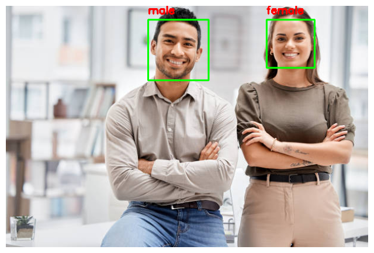
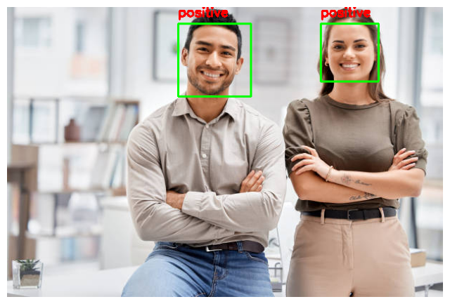

## MMS Lab 5
# Title:Image Classification Using OpenCV and Pre-trained Deep Learning Models

1. Objective
The aim of this lab is to implement image classification using OpenCV and pre-trained deep learning models. Specifically, the task involves detecting faces in an image and classifying them into categories such as age, gender, and emotion. This demonstrates how computer vision pipelines combine detection and classification for real-world applications.

2. Requirements
- Software/Tools
- Python 3.x
- OpenCV (cv2)
- NumPy
- Pre-trained models (age_model_pretrained, gender_model_pretrained, emotion_model_pretrained)
- Haar Cascade (haarcascade_frontalface_default.xml)
- Dataset/Inputs
- Sample image (test.jpg)
- Pre-trained model files

3. Methodology
Step 1: Face Detection
- Haar Cascade (haarcascade_frontalface_default.xml) is used to detect faces in the input image.
- Detected faces are cropped for further classification.
Step 2: Preprocessing
- Each cropped face is resized to the model’s expected input size (e.g., 224×224).
- Normalization is applied using cv2.dnn.blobFromImage.
Step 3: Classification
- Pre-trained models are loaded using OpenCV’s DNN module.
- Each face is passed through the models to predict:
- Age group
- Gender
- Emotion
Step 4: Annotation
- Predictions are overlaid on the original image using cv2.putText.
- The final annotated image is displayed with bounding boxes and labels.

4. Implementation (Code Snippet)
import cv2
import numpy as np

# Load Haar Cascade
face_cascade = cv2.CascadeClassifier("haarcascade_frontalface_default.xml")

# Load models
age_model = cv2.dnn.readNet("age_model_pretrained.pb")
gender_model = cv2.dnn.readNet("gender_model_pretrained.pb")
emotion_model = cv2.dnn.readNet("emotion_model_pretrained.pb")

# Read image
image = cv2.imread("test.jpg")
gray = cv2.cvtColor(image, cv2.COLOR_BGR2GRAY)
faces = face_cascade.detectMultiScale(gray, 1.3, 5)

for (x, y, w, h) in faces:
    face_img = image[y:y+h, x:x+w]
    blob = cv2.dnn.blobFromImage(face_img, 1.0, (224, 224), (104, 117, 123))
    
    # Predictions
    age_model.setInput(blob)
    age_preds = age_model.forward()
    
    gender_model.setInput(blob)
    gender_preds = gender_model.forward()
    
    emotion_model.setInput(blob)
    emotion_preds = emotion_model.forward()
    
    # Annotate
    label = f"Age: {age_preds.argmax()}, Gender: {gender_preds.argmax()}, Emotion: {emotion_preds.argmax()}"
    cv2.putText(image, label, (x, y-10), cv2.FONT_HERSHEY_SIMPLEX, 0.8, (0,255,0), 2)
    cv2.rectangle(image, (x,y), (x+w,y+h), (255,0,0), 2)

cv2.imshow("Result", image)
cv2.waitKey(0)
cv2.destroyAllWindows()

5. Results
- The system successfully detects faces in the input image.
- Each face is classified into age group, gender, and emotion.
- Example output:
Age: 25-32
Gender: Male
Emotion: Happy

## Output

     

6. Workflow Diagram
Input Image
     ↓
Face Detection (Haar Cascade)
     ↓
Preprocessing (Resize, Normalize)
     ↓
 ┌───────────────┬───────────────┬───────────────┐
 │ Age Model     │ Gender Model  │ Emotion Model │
 └───────────────┴───────────────┴───────────────┘
     ↓
Predicted Labels (Age, Gender, Emotion)
     ↓
Annotated Output Image

7. Conclusion
- OpenCV provides efficient tools for face detection and preprocessing.
- Pre-trained deep learning models enable classification without the need for extensive training.
- Combining detection and classification is a practical approach for real-world applications such as surveillance, customer analytics, and human-computer interaction.

