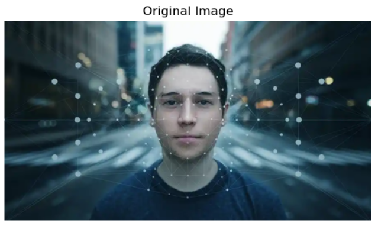
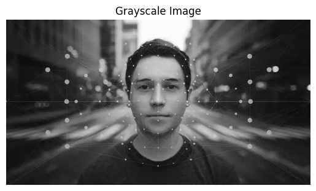
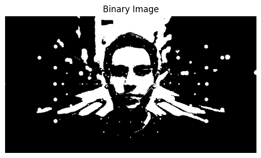
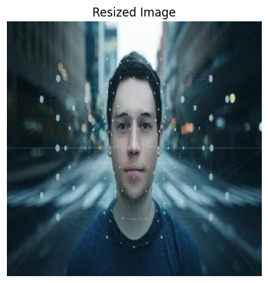
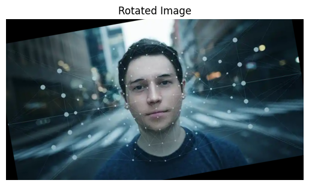
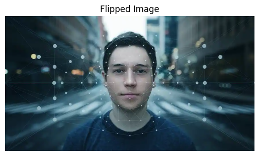
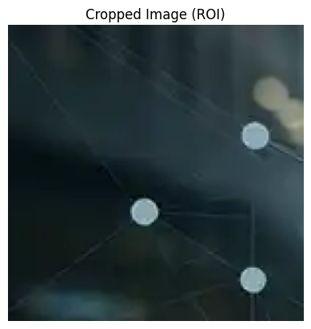

## Title: Fundamentals of Digital Images and Basic Image Operations using python.

## 1. Aim

The aim of this laboratory experiment is to understand the fundamentals of digital images and perform basic image processing operations using Python through practical Jupyter notebooks.

## 2. Objective

The objective of this lab is to study digital image representation and implement basic image operations such as reading, displaying, exploring, converting, transforming images, and extracting regions of interest (ROI) using Python.

## 3. Theory

A digital image is a two-dimensional representation composed of pixels, where each pixel stores intensity or color information. Images can be grayscale or color (RGB). Image processing techniques are used to enhance images, analyze visual information, and extract meaningful features. Python provides powerful libraries like OpenCV, NumPy, PIL, and Matplotlib for efficient image processing.

## 4. Tools and Libraries Used

* Python 3.x
* Jupyter Notebook
* NumPy
* OpenCV (cv2)
* Pillow (PIL)
* Matplotlib

## 5. Lab Folder Structure

```
lab_04/
│── 1.Read_n_display_img.ipynb
│── 2.Explore_image.ipynb
│── 3.Image_Conversion.ipynb
│── 4.Image_Transformation.ipynb
│── 5.ROI_in_an_Image.ipynb
│── person.bmp
│── grayscale person.jpg
│── binary_person.bmp
│── readme.md
```

## 6. Description of Notebooks

### 1. Read and Display Image

* Reads images from the local directory
* Displays images using Matplotlib
* Understands image dimensions and pixel values

### 2. Explore Image

* Examines image properties such as shape, size, data type, and pixel intensity range

### 3. Image Conversion

* Converts color images to grayscale
* Converts grayscale images to binary images

### 4. Image Transformation

* Performs image resizing
* Applies rotation and flipping operations

### 5. Region of Interest (ROI)

* Extracts a specific portion of an image
* Demonstrates ROI usage for focused image analysis

## 7. Sample Python Code

```python
import cv2
import matplotlib.pyplot as plt

image = cv2.imread('person.bmp')
image_rgb = cv2.cvtColor(image, cv2.COLOR_BGR2RGB)

plt.imshow(image_rgb)
plt.title('Original Image')
plt.axis('off')
plt.show()
```

## 8. Output:
         
      
* Images successfully read and displayed
* Image properties explored
* Color to grayscale and binary conversions performed
* Image transformations applied
* Region of interest extracted correctly

## 9. Result

All basic image operations were successfully implemented using Python. The lab helped in understanding digital image fundamentals and practical image processing techniques.

## 10. Conclusion

This experiment provided hands-on experience with digital image processing using Python. The use of multiple notebooks made it easier to understand individual image operations such as reading, conversion, transformation, and ROI extraction.
